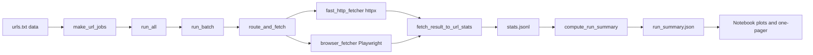
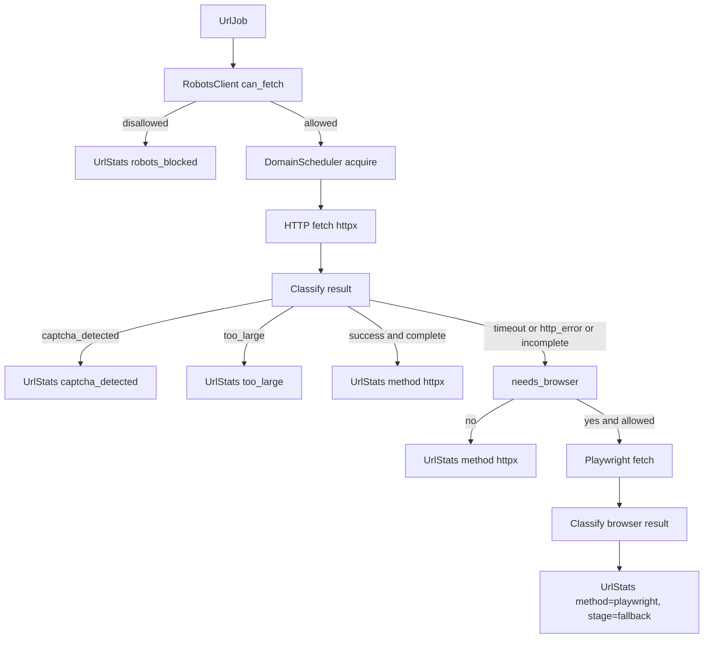

# Tavily Web Scraper

Hybrid HTTP + Playwright scraper for the Tavily Web Research Engineer assignment.

Processes mixed static / JS‑heavy URLs via an HTTP‑first pipeline with browser fallbacks, proxies, robots.txt and CAPTCHA detection, plus a Colab notebook for analysis.

## Quickstart

**Local**

```bash
python -m venv .venv
source .venv/bin/activate  # or .venv\Scripts\activate on Windows

pip install -r requirements.txt
python -m playwright install --with-deps chromium

mkdir -p data
cp /path/to/urls.txt data/urls.txt
# optional
export PROXY_CONFIG_PATH=/path/to/proxy.json

python run_pipeline.py 1000 --success --browser
```

Outputs:

- `data/stats.jsonl` – one `UrlStats` per URL.
- `data/run_summary.json` – aggregate `RunSummary` used in the notebook and one‑pager.

**Colab**

- Open `tavily_scraper/notebooks/tavily_assignment.ipynb` in Colab.
- Run the setup cells (install deps + Playwright).
- Upload `urls.csv` (and optionally `proxy.json`) when prompted.
- Run the execution cell (uses `run_all`) and inspect the plots (latency, status mix, per‑domain behavior).

## Main Entry Points

- Notebook: `tavily_scraper/notebooks/tavily_assignment.ipynb` – orchestration + metrics/visualizations.
- CLI: `python run_pipeline.py 1000 --success --browser` – small batch over `data/urls.txt`.
- Library:
  - `tavily_scraper.pipelines.batch_runner.run_all` – canonical batch runner.
  - `data/stats.jsonl` / `data/run_summary.json` – API for analysis.

## Flow (Mermaid)

High-level run flow:



Per‑URL decision flow:



## Dev Notes

- Code style & architecture: see `.sdd/CODING_RULES.md`, `.sdd/architect.md`, `.sdd/best_practices.md`.
- Useful commands:

  ```bash
  ruff check .
  mypy --strict tavily_scraper/
  pytest --asyncio-mode=auto --cov=tavily_scraper --cov-report=term-missing
  ```
